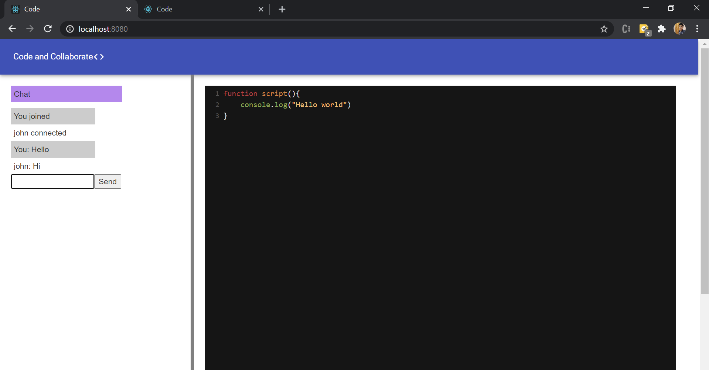
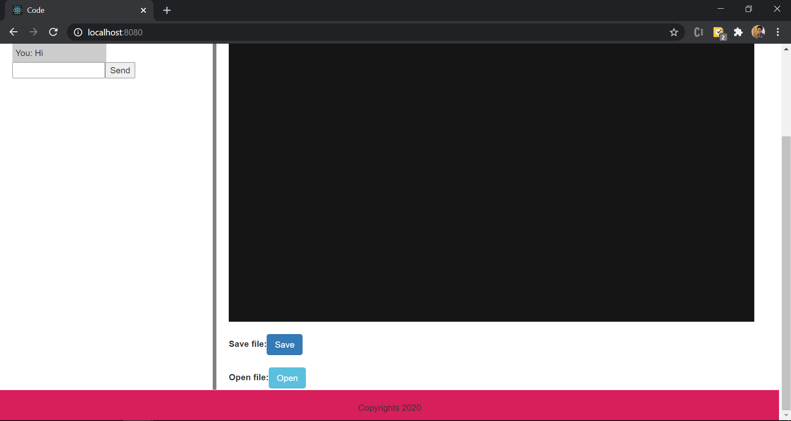

# Code-and-Collaborate
 
run `npm install` on client and server, use `npm start` in respective folders.

by running `npm start` on client, a react app lauches at localhost:8080

This web app can be used for real time code editor with many clients being invloved.
Has save and open option to retrieve file from the database.
if the file is named as an existing file, the content gets updated.
Also includes chat app for interaction on the go.

Screenshots of app in screenshot folder

